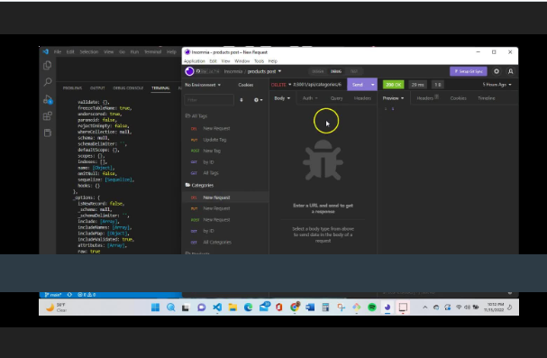

# E-Commerce Back End

## Description

Provide a short description explaining the what, why, and how of your project. Use the following questions as a guide:

- My motivation for this project was  to enhance my skills and use the skills I have already learned.
- I built this project so that I can show my skills to those who are viewing this and help me improve         wherever possible
- This sovles the problem of my needing to learn Object relational mapping
- I learned that there is more involvement in mapping relational objects between files

## Installation

Hit 'npm i' so that you may install all packages for use of the application. 

Enter into mySQL terminal to source the schema. 

'npm run seed' to seed your files and npm run watch to run nodemon for instant updates

## Usage

Provide instructions and examples for use. Include screenshots as needed.

To add a screenshot, create an `assets/images` folder in your repository and upload your screenshot to it. Then, using the relative filepath, add it to your README using the following syntax:

![Screenshot of video snippet of README file being made via the terminal]

## Credits

Did use some tutors and AskBCS.

## License

MIT
